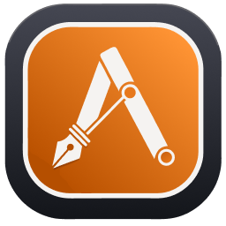
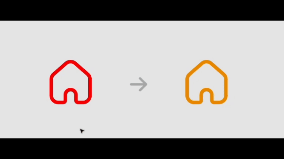
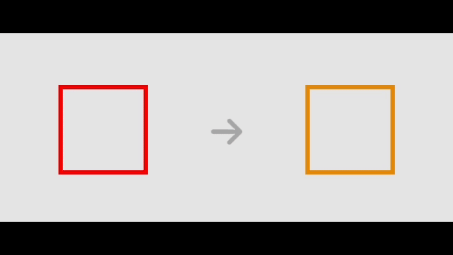
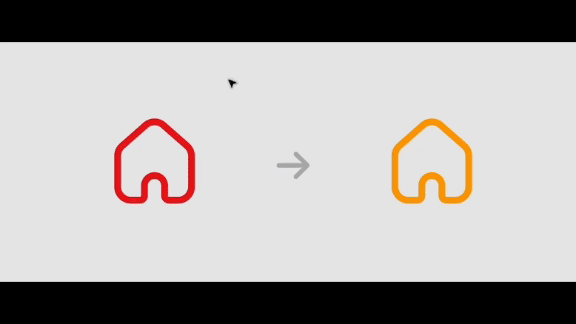

#  
# Vector Tools Beta

**Vector Tools Beta** — это плагин для Figma, предназначенный для очистки, оптимизации и преобразования векторных объектов. Плагин позволяет автоматически упростить структуру векторов, уменьшить количество опорных точек и преобразовать объекты с заливкой в объекты с обводкой для последующей работы с символами шрифтов.

## Функциональные возможности

### 1. Clean Vector

- **Описание:**  
  Функция **Clean Vector** выполняет глубокую распаковку групп, объединяет векторные слои и сохраняет исходное заполнение. Это позволяет избавиться от лишних точек и ненужных группировок, что делает вектор «чище» и удобнее для дальнейшего редактирования.
  
- **Применение:**  
  Выберите область (Selection, Page или Document) и запустите функцию Clean Vector для оптимизации структуры вектора.

---

### 2. Optimize Vector

- **Описание:**  
  Функция **Optimize Vector** пересэмплирует SVG-путь выбранного объекта до заданного количества ключевых точек, сохраняя при этом исходный cornerRadius. Это позволяет уменьшить сложность вектора без потери геометрической точности.
  
- **Применение:**  
  Выберите область вектора и задайте желаемое количество опорных точек. Функция автоматически пересчитает путь, сохраняя актуальные углы и изгибы.

---

### 3. Filled to Stroke

- **Описание:**  
  Функция **Filled to Stroke** преобразует объекты с заливкой в объекты с обводкой. Если в векторе обнаружены кривые (команда "C"), функция сохраняет только необходимый контур (выбирая внешний или внутренний субпуть в зависимости от сложности фигуры) и применяет заданную толщину обводки. Итоговый объект центрируется в родительском контейнере.
  
- **Применение:**  
  Выберите вектор с заливкой, укажите желаемую толщину обводки, и функция автоматически создаст новый stroke-объект с оптимизированными геометрическими настройками.

Плагин создан для команды ITMS 2025 года ©️ Andy Sobol. Все права защищены.